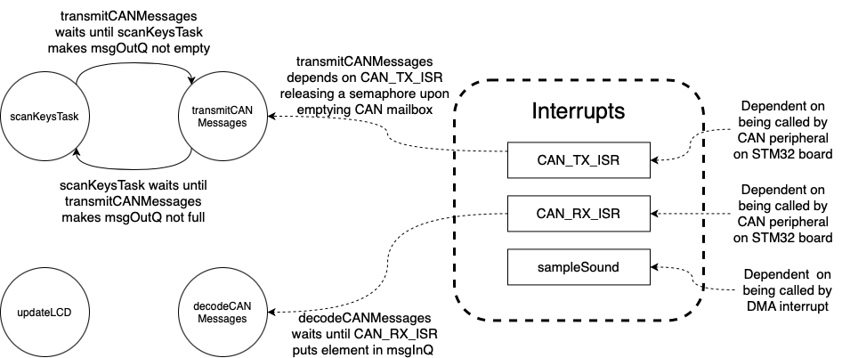

# Documentation of Music Synthesiser

## Table of Contents
- [Documentation of Music Synthesiser](#documentation-of-music-synthesiser)
  - [Table of Contents](#table-of-contents)
  - [Demonstration Video](#demonstration-video)
  - [Tasks Performed by System](#tasks-performed-by-system)
    - [Reading keypresses](#reading-keypresses)
    - [Updating display](#updating-display)
    - [sampleSound (interrupt)](#samplesound-interrupt)
    - [DMA for DAC (speaker)](#dma-for-dac-speaker)
    - [DMA for ADC (joystick)](#dma-for-adc-joystick)
    - [Handling CAN messages](#handling-can-messages)
  - [Critical Instant Analysis of Scheduler](#critical-instant-analysis-of-scheduler)
  - [Quantification of Total CPU Utilisation](#quantification-of-total-cpu-utilisation)
  - [Shared Data Structures](#shared-data-structures)
    - [playedNotes](#playednotes)
    - [volume, octave, sound, and reverb](#volume-octave-sound-and-reverb)
    - [joystick](#joystick)
    - [steps](#steps)
    - [isMaster](#ismaster)
    - [msgInQ](#msginq)
    - [msgOutQ and CAN_TX_Semaphore](#msgoutq-and-can_tx_semaphore)
  - [Analysis of Inter-task Blocking Dependencies](#analysis-of-inter-task-blocking-dependencies)
  - [Advanced Features](#advanced-features)
    - [Polyphony](#polyphony)
    - [Additional Synth Sound Profiles](#additional-synth-sound-profiles)
    - [Reverb](#reverb)
    - [Pitch](#pitch)
    - [External recording](#external-recording)
    - [Class for knobs](#class-for-knobs)

## Demonstration Video

The following video showcases the functionality of the music synthesizer and highlights some of its advanced features.

*insert video*

STM32Cube is used instead of the STM32duino framework to exploit the functionality of the STM32 board such as DMA and reading ADC values with 12-bit resolution. HAL functions are called directly.

## Tasks Performed by System
*talks about freeRTOS?*

DMA (Direct Memory Access) allows direct read/write to the memory. Some tasks were implemented using the DMA to reduce the load of the processor, as it was observed that the processor does not have sufficient capacity to run all the tasks in parallel. DMA is connected to the DAC and ADC directly to read and write from the analog pins on the board.

Below table shows an overview of the tasks that are performed and their corresponding sample rate and priority number. Lower priority numbers denote low priority tasks as stated by Free RTOS [documentation](#https://www.freertos.org/RTOS-task-priority.html)

| Task | minimum initiation interval (ms) | Priority Number |
| --- | --- | --- |
| scanKeysTask | 20 | 4 |
| updateLCD | 100 | 1 |
| decodeCANMessages | *?* | 2 |
| transmitCANMessages | *?* | 3 |
| DMA for ADC | nil *?* | (DMA) |
| DMA for DAC | 45.45 ± 5%  | (DMA) |
|sampleSound| 12.9 | (interrupt) |

As `scanKeysTask` runs with a much higher frequency, it is assigned with a higher priority number compared to `updateLCD`. 

On the other hand, the tasks decoding (`decodeCANMessages`) and transmitting (`transmitCANMessages`) CAN messages are not run at set intervals. Rather, they attempt to read values from FreeRTOS queues / check if semaphores are available. If the queues are empty or the semaphores are unavailable, the tasks block (yield to other tasks) until there are elements to be read in the queue, or the semaphores become available. Their priority was determined as lower than `scanKeysTask`, as it is unacceptatble to miss a user's keypress, but higher than `updateLCD`. To avoid having two tasks with the same priority, the priority for `transmitCANMessages` was arbitrarily set higher than `decodeCANMessages`.

The DMA for ADC has a variable sample rate which is implemented for pitch bend. Please refer [here](#scankeystask) for implementation details.

### Reading keypresses

The `scanKeysTask` task reads the GPIO digital pins (C0 - C3) and determine the state of the keys and knobs on the module. It also writes to the GPIO pins (RA0 - RA2) which allow different "rows" to be read from the key matrix. It also decodes the rotation of the knob by a state transition table. The task is ran with 20ms sample rate such that transient states of the knobs can be captured in most use cases.

As state `01` and `10` of the knob are between detents of the knobs, it is assumed that the next state must be the next detent in the same rotation direction. Hence the transition table below is adopted instead of that stated in the lab instruction. With such transition table, the corresponding data is only increment or decrement by one for every detent. Although transitions cannot be correctly detected when the knobs are rotated quickly, it was decided that it is sufficient most of the time.

| Previous {B,A} | Current {B,A} | Rotation Variable |
| --- | --- | --- |
| 00 | 01 | -1 |
| 00 | 10 | +1 |
| 11 | 01 | +1 |
| 11 | 10 | -1 |

The keys that are pressed and the rotation variable of the knobs are updated and stored in corresponding shared data structures, `playedNotes`, `volume`, `octave`, `sound`, and `reverb`.

Lastly, the task compares the current and previous state of the keyboard using a static variable to track notes have been pressed or released. This is then used to send CAN messages, if the keyboard module is configured as a sender.

### Updating display

The `updateLCD` task reads the state of the keys, knobs, joystick and master/slave from the shared data structures and displays it on the OLED display. It is ran with a sample rate of 100ms such that the OLED refreshes at the same rate as specified in the specification. 

Data corresponding to each knob are printed on a specific coordinate on the display such that they are displayed on top of the knobs for intuitive operation.

*insert image*

### sampleSound (interrupt)

This function is called by an interrupt whenever the DAC DMA has finished reading through either the first or second half of the `steps` array. As `steps` is 600 elements long and the DMA usually operates at 22 kHz, the function will usually be called every 13.6 ms. However, as using the joystick to change the pitch of the DMA changes the frequency of the DMA, the initiation interval can theoretically be as low as 12.9 ms.

It reads the state of the keys and knobs and produce the corresponding sound wave. The sound wave information is written into the `steps` array, which will be read by the DAC DMA. 

### DMA for DAC (speaker)

The DMA reads from the addresses that the `sampleSound` function writes to and send it to the DAC which connects to the speaker. 

### DMA for ADC (joystick)

To read both of the axis of the joystick, the ADC is configured to dual channel (scan) conversion mode. It reads the two channels (A0, A1) in one read and writes to the shared data in the memory via DMA. Data is updated every ADC clock cycle. The ADC has an independent clock domain with a max frequnecy of 80MHz.

### Handling CAN messages

The keyboard can be configured to be a CAN "sender" or "reciever" by pressing the first and second knobs from the left of the keyboard, respectively.

If the module is configured as a sender, it transmits keypress information over the CAN bus as an 8-byte message, with structure as follows:
| Byte Number | Content |
| --- | --- |
| 0 | `'P'` if key is pressed, `'R'` if key is released |
| 1 | Octave number  |
| 2 | Key number from 0-11 |
| 3-8 | Unused |

All CAN messages are sent with an address of `0x123`, with the recieve filter set to only accept incoming messages from that address.

Sender modules do not play audio, instead relying on any reciever modules that they are connected with to output sound. Conversely, reciever modules play not just the notes that are pressed on their own keys, but also the key presses they recieve from sender modules. The recieved notes are played with the settings specific to the reciever module.

To maintain timing requirements for the other functionalities of the keyboard, handling CAN messages is performed using a mixture of interrupts and tasks.

When a CAN message is recieved, it triggers the `CAN_RX_ISR` interrupt, which pushes the recieved message onto a FreeRTOS queue if the board is a reciever. The message is then received from the queue using the `decodeCANMessages` task, which then performs the necessary actions to play the recieve notes.

When a CAN message is to be transmitted, it needs to be written to a Transmit Mailbox in the CAN peripheral on the STM32. If the board is a sender, messages are queued for transmission using a FreeRTOS queue when keys are pressed or released in `scanKeysTask`. The state of the Transmit Mailboxes is tracked using a semaphore, which is taken when CAN messages are received from the transmission queue in the `transmitCANMessages` task, and given when `CAN_TX_ISR` is called in response to the CAN hardware reporting a Transmit Mailbox becoming free.

## Critical Instant Analysis of Scheduler
## Quantification of Total CPU Utilisation

## Shared Data Structures

All of the shared data structures in the system are at one point or another accessed in functions triggered by interrupts. As mutexes cannot be locked within interrupts, the use of mutexes has generally been avoided in our code. Instead, variables have been protected by making use of atomic operations. 

### playedNotes

Information about which keys on the piano are being pressed is stored in a 108 element uint8_t array called `playedNotes`. Though there are only 12 keys on each synthesizer, the `playedNotes` array is 108 elements long to make connecting multiple synthesizers together easier. The array elements give the states of each note in consecutive order from the deepest note to the highest note, starting with C0 at index 0 and going up to B8 at index 107. A zero entry means that the note is not being played a non-zero entry means that the note is being played.

The `playedNotes` array is accessed by the functions `sampleSound()`, `scanKeysTask()`, `Knob::update()`, `updateLCD()` and (`decodeCANMessages()`). To ensure synchronisation between tasks, the array has been declared using the keyword `volatile` which means that the variable will be accessed from memory, rather than from local registers, each time it is used. To guarantee safe access between threads the elements in the `playedNotes` array are always accessed using atomic operations. Specifically, we use the functions `__atomic_load_n()` and `__atomic_store_n()`.

### volume, octave, sound, and reverb

`volume`, `octave`, `sound` and `reverb` are uint8_t variables which store the volume, octave level, sound profile and amount of reverb of the synthesizer. These variables are accessed by the functions `sampleSound`, `updateLCD()`, `Knob::update()` and `decodeCANMessages()`. To ensure synchronisation between tasks, each of the variables have been declared using the keyword `volatile` which means that the variable will be accessed from memory, rather than from local registers, each time it is used. To guarantee safe access between threads the variables are always accessed using atomic operations, through the functions `__atomic_load_n()` and `__atomic_store_n()`.

### joystick

`joystick` is variable of type `ADC` which is a custom struct which has the member variables `pitch` and `modulation` which track the x-position and y-position of the joystick respectively. It is declared as a struct instead of two separate variables to ensure they are placed in the memory consecutively. This allows the DMA to read the two values from the ADC and writes to the memory as one data structure. 

`pitch` and `modulation` are accessed by the function `sampleSound()` and a DMA. `sampleSound()` only reads from the variables, while the DMA only writes to the variables. To ensure that `sampleSound()` always uses the most up to date value of the variables, `joystick` has been declared as a volatile variable.

### steps

`steps` is a 600 element uint32_t array found in sawtooth.cpp. The array is accessed both by the `sampleSound()` function and a DMA which writes the values stored in the array to the DAC. As `sampleSound()` only writes to and never reads `steps` it is not necessary to declare the array as volatile. To guarantee safe access to the array the `sampleSound()` function and the DMA never operate on data in the same half of the array. Whenever the DMA reads the middle element of the `steps` array it triggers an interrupt which calls `sampleSound()` which then updates the first half of the array. Likewise, when the DMA reads the last element of the `steps` array, an interrupt is triggered which causes *sampleSound()* to update the second half of the `steps` array. This way, the `sampleSound()` function never updates elements in the part of the array which is currently being read by the DMA.

### isMaster

`isMaster`is a uint8_t variable which is set to a non-zero value when a synth is to be a receiever module and set to zero when a synth is to be a sender module. The variable is accessed by the functions `CAN_RX_ISR()`, `detectKeyPress()`, `scanKeysTask()`, `update_lcd()`, and `sampleSound()`. To ensure synchronisation between tasks, each of the variables have been declared using the keyword `volatile`. To ensure thread safe access, the variable is always accessed using atomic operations.

### msgInQ

Incoming CAN messages are recieved in the `CAN_RX_ISR()` ISR and processed in the `decodeCANMesssages()` task. Thread safety is achieved with `msgInQ`, a FreeRTOS queue. It holds 36 8-byte values corresponding to an 8-byte CAN message.
`CAN_RX_ISR()` writes to `msgInQ` using `xQueueSendFromISR`, and `decodeCANMessages()` reads from `msgInQ` using `xQueueReceive`. 

In this way, many messages can be recieved from the CAN hardware and processed at an appropriate rate without causing the rest of the system to lag.

### msgOutQ and CAN_TX_Semaphore

Outgoing CAN messages are generated when keys are detected as pressed or released in `scanKeysTask()`. These messages are sent to a FreeRTOS queue, `msgOutQ` that holds 36 8-byte messages. The `transmitCANMessages()` task then reads from the queue.

However, simply sending messages read from `msgOutQ` to the CAN bus may not work because the CAN hardware only has three Transmit Mailboxes. If the Transmit Mailboxes are full, further CAN messages cannot be sent. Therefore, a Counting Semaphore with length 3, `CAN_TX_Semaphore`, is used to keep track of the availability of the Transmit Mailboxes. Each time a message is taken from `msgOutQ` to be transmitted over CAN, `transmitCANMessages()` takes from `CAN_TX_Semaphore`. When a mailbox becomes free, `CAN_TX_ISR()` is called, which then gives `CAN_TX_Semaphore`.

In this way, many messages can be queued for transmission over CAN at a rate allowed by CAN hardware without needing the rest of the system to wait for the CAN hardware to become available.

## Analysis of Inter-task Blocking Dependencies

The image below lays out the dependencies between different tasks and interrupts.

Due to the use of DMAs and interrupts there are very few dependencies between threads in our system. The only two threads that have dependencies on other tasks is the thread running `scanKeysTask()` and the thread running `transmitCANMessages()`. These two threads are dependent on one another, through the queue used to store outgoing-messages, `msgOutQ`. If the queue is full, `scanKeysTask` will block until `transmitCANMessages()` removes an element from the queue. Likewise, if the queue is empty, `transmitCANMessages()` will block until `scanKeysTask` puts an element into the queue. Despite the two threads being dependent on oneanother, a deadlock will never occur as the queue for outgoing messages can never be both empty and full at the same time.

Some threads also depend on the execution of interrupts. Specifically, the `transmitCANMessages()` task is dependent on the `CAN_TX_ISR` releasing a semaphore. Likewise, the `decodeCANMessages` thread is dependent on the `CAN_TX_ISR` placing elements in the queue `msgInQ`.

## Advanced Features

### Polyphony

The first extension to the functionality of the synthesizer is Polyphony, i.e. being able to play multiple notes at the same time. Polyphony is enabled for all sound profiles except the standard sawtooth sound profile. Polyphony was implemented by first adding separate accumulators of type int32_t for all of the notes between C0 and B8. Whenever multiple notes are played at the same time, the values of the accumulators belonging to the notes being played are first shifted based on the current volume of the synth, then all added together. Finally, an offset is added to the sum of the accumulators to find which value should be written to the DAC. There is no limit on how many notes can be played at the same time and in theory all 108 notes between C0 and B8 can be played at the same time.

### Additional Synth Sound Profiles

1. #### Poly

This sound profile is identical to the standard sawtooth sound profile, except that polyphony is enabled when this sound profile is selected.

2. #### Chorus

The chorus sound profile gives the piano a "richer" sound. Chorus still uses sawtooth waveforms to produce different frequencies, however a note no longer consists of a single sawtooth waveform. Instead, each note consists of three sawtooth waveforms of slightly different frequencies. This produces a very pleasent sound profile and makes the piano sound like a choir.

3. #### Laser

The *Laser* sound profile is similar to the chorus sound profile, but now every note consists of 5 sawtooth waveforms of slightly different frequencies. The sound profile has been given the name "Laser" as pressing a note produces a sound similar to what laser blasters traditionally produce in movies. 

4. #### Sine

In the *Sine* sound profile the sawtooth waveforms have been replace by sine waves. Different frequency sine waves are produces by looping through an array, which holds one period of a sine wave, at different speeds. The produced sound is far softer than that produced by any of the other sound profiles.

### Reverb

A reverb (.i.e echo) setting has been implemented for the synth. There are 8 selectable levels of reverb where level 0 corresponds to no reverb and 7 corresponds to a lot of reverb. Reverb is implemented through the FIFO `reverbArray` which stores the values which have previously been written to the DAC. Then every time `sampleSound()` calculates new values to write to the DAC, the values stored in the FIFO are scaled proportional to the `reverb` variable and added to the array calculated by `sampleSound()`. The values added from the FIFO are delayed by ~136 ms, which emulates a room of approximately 50 meters across.

### Pitch

The joystick on the synth can be used to change the pitch of a notes. Moving the joystick up or down will cause the DMA which reads data to the DAC to speed up or slow down by up to 5.94 %, thereby making the notes being played higher or deeper by up to one full note. 

### External recording

A recording of the sound can be taken which is transmitted to a python script and saved as a WAV file. Ensure that the correct port (eg `COM5` , `/dev/ttyUSB0` etc) is used in the script and the port is free. Recordings are started by pressing the second knob from the right and stopped by pressing the rightmost knob.

https://user-images.githubusercontent.com/59867245/159928676-91e2b35d-6b7a-4b5b-9cfe-44a8f511da63.mp4

### Class for knobs

A class for the knobs `Knob` is implemented. It is initialized with a pointer to the corresponding shared data (`volume`, `octave`, `sound`, `reverb`) in the class constructor. The method `update` reads in the old state and new state of the knob and writes the rotation variable to the address of the pointer.

Such implementation gives a cleaner code in the `scanKeysTask` task. This can also support future extension such as switching functionality of each knob simply by changing the child pointer in the class.
